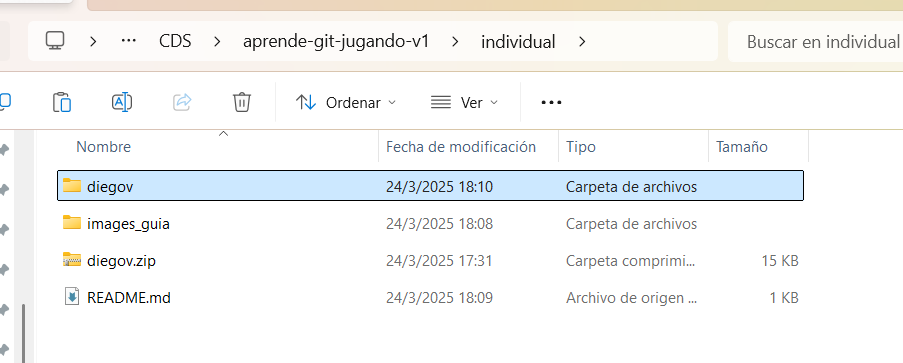

# 🚀 Guía para Crear un proyecto en Spring Boot
Este README.md está diseñado para ayudar a los participantes a iniciar su proyecto en Spring Boot de manera rápida y sencilla.

## 🛠️ Pasos para Crear el Proyecto
### 1️⃣ Ir a Spring Initializr
🔗 Accede a la página oficial: [Spring Initializr](https://start.spring.io/)

### 2️⃣ Configurar el Proyecto
📌 Realizar la configuración para el proyecto que eligieron:

 

  💡 **Nota:** No es obligatorio seguir esta configuración exactamente. ¡Siéntete libre de personalizarla según tus necesidades!. 
### 3️⃣ Generar y Descargar el Proyecto
✅ Haz clic en el botón "GENERATE". Esto descargará un archivo .zip con tu proyecto.
- Los siguientes pasos realizar en su rama correspondiente.
### 4️⃣ Copiar el Archivo a tu Carpeta
🔀 **Importante: Antes de continuar, asegúrate de estar en tu rama de Git correspondiente.**

📂 Mueve el archivo .zip a la carpeta individual.

### 5️⃣ Descomprimir el Archivo
📦 Extrae el contenido del archivo .zip en la misma carpeta.

🗑️ Opcional: Luego de descomprimir el archivo, puedes eliminar el .zip para ahorrar espacio.
### 6️⃣ ¡Listo para Empezar!
🚀 Dentro de la carpeta descomprimida, ya puedes comenzar a trabajar en tu proyecto.

👨‍💻 ¡Feliz coding! 🚀🎉